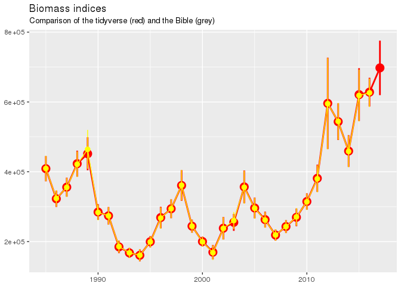
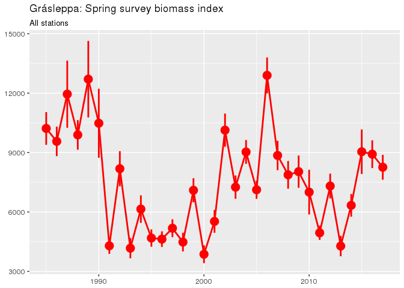
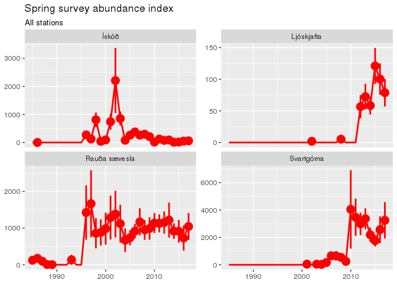
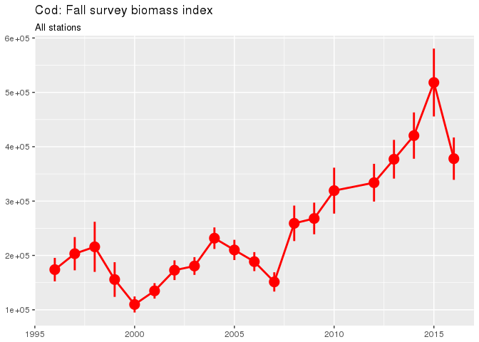

# pax


## Preamble
___

... pax: population analysis in unix. This is a resuscitation of an old name - but likely going to do more.

Have you wished for a painless way to generate survey indices. Give the following a try.

## Needed packages
___


```r
devtools::install_github("fishvice/husky", dependencies = FALSE) # A temporary measure
devtools::install_github("fishvice/pax", dependencies = FALSE)
```

In addition it is assumed you have the __fjolst__-package.

## Loading needed libraries
___


```r
library(tidyverse)
library(fjolst)    # for the time being
library(pax)
```

## Length based indices
___

### Specify the stations and strata

OK, here you have to have some background knowledge. But we select "all" SMB stations:


```r
Station <- 
  husky::STODVAR %>% 
  bind_rows() %>% 
  filter(tognumer %in% 1:39) %>% 
  select(id = synis.id, year = ar, towlength = toglengd, strata = newstrata) %>% 
  mutate(towlength = pax:::trim_towlength(towlength),
         mult = 1) %>% 
  arrange(id)
```

And get the appropriate strata as well (the old strata, which is not the same as the very old strata):


```r
Stratas <-
  husky::stratas_df %>% 
  select(strata, area = rall.area)
```


And then we leave the rest to the `smx:calc_length_indices`-function:

#### Cod spring survey index


```r
res <- calc_length_indices(Station, Stratas, SPECIES = 1)
```

Extracting the tidy information and preparing the plot:

```r
tidy_fixed <-
  res$aggr %>% 
  filter(length == 5) %>% 
  mutate(source = "tidy")
p <- 
  tidy_fixed %>% 
  select(year, cb, cb.cv) %>% 
  ggplot(aes(year, cb)) +
  geom_pointrange(aes(ymin = cb * (1 - cb.cv),
                      ymax = cb * (1 + cb.cv)),
                  colour = "red", lwd = 1) +
  geom_line(colour = "red", lwd = 1) +
  scale_colour_brewer(palette = "Set1")
```

Lets add the official calculations for comparison:

```r
attach("/net/hafkaldi/export/u2/reikn/Splus5/SMB/Allindices.RData")
mri <- 
  All.indices %>% 
  filter(species == 1,
         svaedi == "Heild",
         lengd == 5,
         type == "all") %>% 
  select(year = ar, cb = bio.staerri, cb.cv = cv.bio.staerri, type) %>% 
  mutate(source = "mri")

p +
  geom_pointrange(data = mri, 
                  aes(ymin = cb * (1 - cb.cv),
                      ymax = cb * (1 + cb.cv)),
                  colour = "yellow") +
  geom_line(data = mri, colour = "yellow") +
  labs(x = NULL, y = NULL,
       title = "Biomass indices",
       subtitle = "Comparison of the tidyverse (red) and the Bible (grey)")
```

<!-- -->

__Something to worry about__:?

```r
tidy_fixed %>% 
  select(year, cb) %>% 
  left_join(mri %>% select(year, cb2 = cb)) %>% 
  mutate(diff = (cb - cb2)/cb2 * 100) %>% 
  summary()
```

```
##       year            cb              cb2              diff       
##  Min.   :1985   Min.   :161148   Min.   :160877   Min.   :0.1020  
##  1st Qu.:1993   1st Qu.:242193   1st Qu.:241671   1st Qu.:0.1872  
##  Median :2000   Median :289394   Median :288828   Median :0.2158  
##  Mean   :2000   Mean   :327553   Mean   :326905   Mean   :0.1977  
##  3rd Qu.:2008   3rd Qu.:388204   3rd Qu.:387380   3rd Qu.:0.2161  
##  Max.   :2016   Max.   :627611   Max.   :626306   Max.   :0.2161
```

So the tidyverse is 0.2% higher than the mri - some may want to dig into that.

#### Grásleppa spring survey index

Here lets try to calculate the index for Grásleppa. We use the same station set and strata as above. Hence only need to do specify in addition the sex:

```r
res <- calc_length_indices(Station, Stratas, SPECIES = 48, Sex = 2)
# and a quick plot
res$aggr %>% 
  filter(length == 5) %>% 
  select(year, cb, cb.cv) %>% 
  ggplot(aes(year, cb)) +
  geom_pointrange(aes(ymin = cb * (1 - cb.cv),
                      ymax = cb * (1 + cb.cv)),
                  colour = "red", lwd = 1) +
  geom_line(colour = "red", lwd = 1) +
  scale_colour_brewer(palette = "Set1") +
  labs(x = NULL, y = NULL,
       title = "Grásleppa: Spring survey biomass index",
       subtitle = "All stations")
```

<!-- -->

#### "non-standard" species spring survey index


```r
spe88 <- calc_length_indices(Station, Stratas, 88, lwcoeff = c(0.01, 3))
spe562 <- calc_length_indices(Station, Stratas, 562, lwcoeff = c(0.01, 3))
spe150 <- calc_length_indices(Station, Stratas, 150, lwcoeff = c(0.01, 3))
spe71 <- calc_length_indices(Station, Stratas, 71, lwcoeff = c(0.01, 3))
spe88$aggr %>% mutate(Species = "Rauða sævesla") %>% 
  bind_rows(spe562$aggr %>% mutate(Species = "Ljóskjafta")) %>% 
  bind_rows(spe150$aggr %>% mutate(Species = "Svartgóma")) %>% 
  bind_rows(spe71$aggr %>% mutate(Species = "Ískóð")) %>% 
  filter(length == 140) %>% 
  select(year, Species, cn, cn.cv) %>% 
  ggplot(aes(year, cn)) +
  geom_pointrange(aes(ymin = cn * (1 - cn.cv),
                      ymax = cn * (1 + cn.cv)),
                  colour = "red", lwd = 1) +
  geom_line(colour = "red", lwd = 1) +
  scale_colour_brewer(palette = "Set1") +
  facet_wrap(~ Species, scale = "free_y") +
  labs(x = NULL, y = NULL,
       title = "Spring survey abundance index",
       subtitle = "All stations")
```

```
## Warning: Removed 58 rows containing missing values (geom_pointrange).
```

<!-- -->

So we have an invasion of Ljóskjafta and Svartgóma in recent years. That must explain the mackerel invasion :-)

NOTE: There is a bug when it comes to the biomass estimates of the two last species. And one needs to double test for when some species were only counted.

#### And at last be not the least - the fall survey


```r
Stations <- 
  smh_strata_setup() %>% 
  select(id = synis.id, year = ar, towlength = toglengd, strata = newstrata) %>% 
  mutate(towlength = pax:::trim_towlength(towlength),
         mult = 1) %>% 
  arrange(id)
```

```
## Strata fannst ekki fyrir stodvar 76,77,154,484,925,1099,1101,1303,2061,2566,2674,3059,3102,3316,3712,4309,4398,4835,5085,5484,5793,6367,6375,6906,6914,7289
```

```r
Stratas <-
  husky::newstratas_df %>% 
  select(strata, area = rall.area)
res <- calc_length_indices(Stations, Stratas, SPECIES = 1)
res$aggr %>% 
  filter(length == 5) %>% 
  select(year, cb, cb.cv) %>% 
  ggplot(aes(year, cb)) +
  geom_pointrange(aes(ymin = cb * (1 - cb.cv),
                      ymax = cb * (1 + cb.cv)),
                  colour = "red", lwd = 1) +
  geom_line(colour = "red", lwd = 1) +
  scale_colour_brewer(palette = "Set1") +
  labs(x = NULL, y = NULL,
       title = "Cod: Fall survey biomass index",
       subtitle = "All stations")
```

<!-- -->

## Age based indices
___

Still under development (needs further testing), but here is one trial.


```r
# Lest start from scratch
stratas <-
  husky::stratas_df %>% 
  select(strata, area = rall.area)
SPECIES <- 1
lengthclass <- c(seq(4.5, 109.5, by = 5), 119.5, 139.5)
ind <- c(31931, 31932, 32131, 36731, 37031, 37131, 37132, 37231, 41431, 41531, 42231, 42232, 47431, 52331)
st1 <-
  bind_rows(husky::STODVAR) %>%
  filter(tognumer < 20 | index %in% ind) %>%
  mutate(region = ifelse(area %in% c(1, 9, 10), "south",
                         ifelse(area %in% c(2:8), "north", NA))) %>%
  filter(!is.na(region)) %>%
  select(synis.id, ar, towlength = toglengd, region, strata = newstrata)

st2 <-
  bind_rows(husky::STODVAR) %>% 
  filter(area %in% 1:10) %>% 
  bind_rows(lesa.stodvar(leidangur="A4-2001")) %>% 
  mutate(region = ifelse(area %in% c(1, 9, 10), "south",
                         ifelse(area %in% c(2:8), "north", NA))) %>%
  filter(!is.na(region)) %>%
  select(synis.id, ar, towlength = toglengd, region, strata = newstrata)

x <- calc_age_indices(st_length = st1, st_ototliths = st2, species = 1)
x$aggr %>% 
  mutate(n = round(n/1e6, 2)) %>% 
  select(-n.cv) %>% 
  filter(aldur %in% 1:11) %>% # just to fit things on the screen
  spread(aldur, n) %>% 
  as.data.frame()
```

```
##      ar     1      2      3      4     5     6     7     8    9   10   11
## 1  1985 16.58 110.73  35.52  48.60 64.65 23.07 15.31  5.07 3.40 1.84 0.29
## 2  1986 15.10  60.71  96.15  22.51 21.53 27.55  7.17  2.80 0.94 0.82 0.30
## 3  1987  3.66  28.32 104.66  83.00 21.38 12.75 12.95  2.80 0.99 0.42 0.44
## 4  1988  3.45   7.07  72.67 103.77 69.68  8.39  6.45  7.22 0.67 0.28 0.12
## 5  1989  4.05  16.43  22.10  80.04 74.32 39.26  4.85  1.70 1.41 0.27 0.19
## 6  1990  5.57  11.82  26.16  14.20 28.04 35.24 16.77  1.75 0.58 0.48 0.13
## 7  1991  3.95  16.06  18.24  30.28 15.53 19.03 22.47  4.91 0.94 0.31 0.22
## 8  1992  0.72  16.94  33.67  18.97 16.71  6.91  6.35  5.79 1.49 0.23 0.03
## 9  1993  3.57   4.78  30.97  36.84 13.55 10.64  2.43  2.04 1.40 0.41 0.13
## 10 1994 14.44  15.02   9.07  26.97 22.48  6.09  3.97  0.80 0.54 0.51 0.18
## 11 1995  1.08  29.37  24.85   9.08 24.57 18.48  4.03  1.92 0.38 0.19 0.24
## 12 1996  3.73   5.45  42.70  29.49 12.91 14.66 14.05  3.82 1.04 0.17 0.05
## 13 1997  1.18  22.23  13.53  56.28 29.22  9.54  8.81  6.71 0.58 0.27 0.15
## 14 1998  8.08   5.37  30.04  16.13 62.23 28.92  6.65  5.27 3.05 0.68 0.19
## 15 1999  7.41  33.05   7.03  42.32 13.11 23.72 11.11  2.34 1.29 0.75 0.18
## 16 2000 18.92  27.67  55.12   6.92 30.08  8.41  8.20  4.14 0.49 0.28 0.09
## 17 2001 12.30  23.50  36.49  38.17  4.86 15.26  3.34  2.01 0.76 0.23 0.11
## 18 2002  0.97  38.57  41.41  40.32 36.75  7.17  8.06  1.48 0.72 0.29 0.06
## 19 2003 11.20   4.21  46.58  36.61 28.45 16.87  3.76  4.42 0.98 0.35 0.15
## 20 2004  7.02  26.51   8.13  64.68 38.50 27.97 15.94  2.81 3.27 0.56 0.34
## 21 2005  2.70  17.84  41.81   9.99 46.83 25.24 12.02  6.25 0.98 0.98 0.24
## 22 2006  9.12   7.45  25.12  40.62 11.76 31.69 11.77  3.95 1.58 0.28 0.18
## 23 2007  5.67  19.05   9.05  23.03 30.12 10.11 11.50  6.05 2.41 0.84 0.27
## 24 2008  6.76  12.44  23.08   9.87 22.92 22.89  9.27  7.95 3.00 0.78 0.44
## 25 2009 22.01  12.66  16.66  22.97 15.79 26.48 16.50  4.54 3.11 1.12 0.26
## 26 2010 18.73  21.59  18.94  18.28 24.67 14.27 18.53  9.94 3.07 1.88 0.55
## 27 2011  3.58  23.05  27.64  20.17 23.05 26.84 14.74 13.43 4.91 0.98 0.98
## 28 2012 20.41  11.04  39.53  57.23 42.31 31.53 28.16 10.79 6.97 3.16 0.91
## 29 2013 10.96  33.72  18.18  44.68 47.12 26.06 17.64 14.64 7.03 3.36 1.68
## 30 2014  3.31  24.29  38.93  23.82 47.67 38.28 18.14  8.29 4.33 2.22 0.86
## 31 2015 21.10  10.98  28.11  42.51 21.33 42.08 29.35 16.99 5.11 3.16 1.48
## 32 2016 31.63  31.65  15.25  37.72 54.88 28.05 38.38 19.41 6.94 2.36 1.21
```

Above it not a perfect match with the husky-approach, but who says the latter is correct :-)

## Some info

```r
devtools::session_info()
```

```
##  setting  value                       
##  version  R version 3.3.1 (2016-06-21)
##  system   x86_64, linux-gnu           
##  ui       X11                         
##  language (EN)                        
##  collate  is_IS.UTF-8                 
##  tz       Atlantic/Reykjavik          
##  date     2016-12-16                  
## 
##  package    * version    date       source        
##  assertthat   0.1        2013-12-06 CRAN (R 3.0.2)
##  backports    1.0.4      2016-10-24 cran (@1.0.4) 
##  colorspace   1.2-6      2015-03-11 CRAN (R 3.2.0)
##  DBI          0.5-1      2016-09-10 cran (@0.5-1) 
##  devtools     1.12.0     2016-12-05 CRAN (R 3.3.1)
##  digest       0.6.10     2016-08-02 cran (@0.6.10)
##  dplyr      * 0.5.0      2016-06-24 CRAN (R 3.3.1)
##  evaluate     0.10       2016-10-11 cran (@0.10)  
##  fjolst     * 1.0        2016-12-01 local         
##  geo        * 1.4-3      2015-07-03 CRAN (R 3.3.1)
##  ggplot2    * 2.2.0      2016-11-11 CRAN (R 3.3.1)
##  gtable       0.2.0      2016-02-26 cran (@0.2.0) 
##  htmltools    0.3.5      2016-03-21 CRAN (R 3.3.0)
##  husky        0.0.3.9000 2016-12-14 local         
##  knitr        1.15.1     2016-11-22 cran (@1.15.1)
##  labeling     0.3        2014-08-23 CRAN (R 3.2.0)
##  lazyeval     0.2.0      2016-06-12 cran (@0.2.0) 
##  magrittr     1.5        2014-11-22 CRAN (R 3.1.2)
##  mapdata    * 2.2-6      2016-01-14 cran (@2.2-6) 
##  maps       * 3.1.1      2016-07-27 cran (@3.1.1) 
##  memoise      1.0.0      2016-01-29 CRAN (R 3.3.0)
##  munsell      0.4.3      2016-02-13 cran (@0.4.3) 
##  ora          2.0-1      2014-04-10 CRAN (R 3.1.2)
##  pax        * 0.0.1.9000 2016-12-16 local         
##  plyr         1.8.4      2016-06-08 cran (@1.8.4) 
##  purrr      * 0.2.2      2016-06-18 cran (@0.2.2) 
##  R6           2.2.0      2016-10-05 cran (@2.2.0) 
##  Rcpp         0.12.8     2016-11-17 cran (@0.12.8)
##  readr      * 1.0.0      2016-08-03 CRAN (R 3.3.1)
##  rmarkdown    1.2        2016-11-21 cran (@1.2)   
##  ROracle      1.2-2      2016-02-17 CRAN (R 3.3.0)
##  rprojroot    1.1        2016-10-29 cran (@1.1)   
##  scales       0.4.1      2016-11-09 CRAN (R 3.3.1)
##  stringi      1.1.1      2016-05-27 cran (@1.1.1) 
##  stringr      1.1.0      2016-08-19 CRAN (R 3.3.0)
##  tibble     * 1.2        2016-08-26 CRAN (R 3.3.1)
##  tidyr      * 0.6.0      2016-08-12 cran (@0.6.0) 
##  tidyverse  * 1.0.0      2016-09-09 CRAN (R 3.3.1)
##  withr        1.0.2      2016-06-20 CRAN (R 3.3.0)
##  yaml         2.1.14     2016-11-12 cran (@2.1.14)
```

